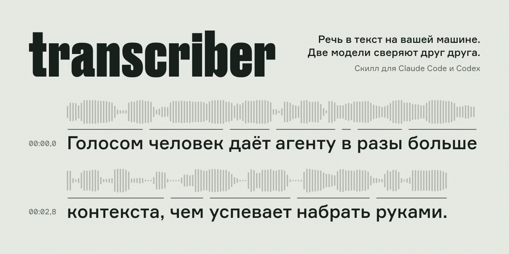

<div align="center">

# transcriber

**Расшифровка аудио и видео в текст на вашей машине: скилл для Claude Code и Codex.**

Русский и английский, две модели сверяют друг друга, спикеры по именам, субтитры SRT и VTT.
Файлы и ссылки: YouTube, ВК Видео, Рутуб, подкасты Яндекс Музыки.

[](#установка)
[](#установка)
[](https://github.com/tonyprots/transcriber-skill/releases/latest)
[](https://github.com/tonyprots/transcriber-skill/actions/workflows/test.yml)
[](https://github.com/tonyprots/transcriber-skill/actions/workflows/release-smoke.yml)
[](LICENSE)



<sub><a href="#установка">Установка</a> · <a href="#использование">Использование</a> · <a href="#замеры">Замеры</a> · <a href="#зачем-это-нужно-в-цифрах">Зачем это нужно, в цифрах</a> · <a href="#ограничения-и-что-дальше">Ограничения</a> · <a href="#english-summary">English summary</a></sub>

</div>

---

Скилл, который превращает запись в текст прямо на вашем компьютере:
голосовое, диктовку, интервью, созвон на шестерых, подкаст из Яндекс Музыки,
видео с YouTube, ВК Видео или Рутуба. Скажите агенту «расшифруй» и
приложите файл или ссылку. Вернутся дословный и читаемый текст, субтитры,
разметка по спикерам и короткий список мест, которые стоит переслушать.

Голосом человек даёт агенту в разы больше контекста, чем успевает набрать
руками: правки по презентации, замечания к отчёту, мысль целиком, а не
огрызок. Упирается это в расшифровку. Обычно её делает одна модель, и на
рабочем сленге, названиях продуктов и аббревиатурах она спотыкается, а
заметить подмену в чужом тексте труднее всего.

## В чём фишка

- **Две модели слушают одно и то же.** Вторая не правит первую, а отмечает,
    где они разошлись. Такие места собираются в `review-needed.md` с
  таймкодами: на часовом интервью это 2,7 минуты звука вместо 75. Сколько
  ошибок попадает в эти места, измерено пока только на прежней, более
  грубой очереди (подробнее в «Зачем это нужно, в цифрах»).
- **Модель под язык.** Для русского основная — GigaAM v3 от Сбера. На
  обиходной речи она ошибается в 2,3 раза реже Whisper, которого обычно
  ставят по умолчанию (Common Voice, 800 фраз); на зачитанных текстах с
  иностранными именами (FLEURS) модели вровень. Для английского — Whisper
  Turbo с проверкой Parakeet.
- **Словарь терминов собирается сам.** Скилл снимает кандидатов из
  расхождений моделей: сам включает замену, когда термин повторился в трёх
  разных записях, а остальное приносит списком, где человеку достаточно
  подтвердить написание.
- **Текст не ждёт проверки.** С `--early-text` читаемый текст готов сразу
  после основной модели, в 3–4 раза раньше конца прогона: проверяющая его не
  меняет и досчитывается ради очереди и словаря.
- **Названия не теряются молча.** Если основная модель исказила термин из
  словаря, а проверяющая написала его как надо («Макросов» → Microsoft), в
  тексте встаёт правильное написание. Если основная название уронила совсем
  («OpenAI понижает лимиты» → «понижает лимиты»), место выходит наверх
  отчёта: «Возможно, выпало из текста». Типовые выдумки Whisper
  («Продолжение следует...») в очередь не попадают.
- **Короткая очередь.** Разделы отчёта показывают по 25 самых весомых мест,
  остальное лежит в `segments.json`: отчёт читается, а не листается.
- **Распознавание на вашем компьютере.** Звук и текст не уходят во внешний
  сервис распознавания, исходный файл не меняется. В сеть скилл ходит за
  весами моделей на Hugging Face (пока они не скачаны), за звуком по вашей
  ссылке и, по просьбе `doctor.py --check-updates`, за списком новых версий
  моделей. `--offline` запрещает сеть совсем. Тексты гипотез остаются в кэше
  на диске, см. «Кэш и приватность».

## Что умеет

- **Файлы:** m4a, mp3, wav, ogg из мессенджеров, видео любых форматов,
  которые понимает ffmpeg.
- **Ссылки:** YouTube и сотни других сайтов через `yt-dlp`, ВК Видео и
  Рутуб, выпуски подкастов Яндекс Музыки. Звук качается лёгкой дорожкой
  в восемь потоков: час с ВК Видео за 30 секунд.
- **Готовые субтитры за секунды,** когда ролик надо понять и цитировать из
  него не будут. Автоперевод YouTube и распознавание площадки помечаются,
  чтобы их не выдали за авторский текст.
- **Субтитры с копии на YouTube.** У ролика с Рутуба или ВК своих субтитров
  нет? Скилл найдёт ту же запись на YouTube и возьмёт её субтитры, но только
  после сверки по звуку в двух точках. Чужой выпуск той же серии не пройдёт.
- **Цитата без расшифровки часа.** `--section 10:50-11:30` расшифровывает
  только кусок, таймкоды остаются по исходнику. Нашли цифру в субтитрах —
  проверили её по звуку за полминуты.
- **Пачкой.** Десяток ссылок или целый плейлист (`--playlist`) одним
  вызовом, каждая запись в свой каталог; отказ одной не останавливает
  остальные, а `--skip-done` продолжает прерванную пачку с того же места.
  Прогоны встают в общую очередь на машину и не отнимают друг у друга ядра.
- **Спикеры:** `--diarize` делит разговор по голосам, справляется и со
  встречей на шестерых. Имена вместо «Спикер 1» ставятся флагом или потом,
  в готовую расшифровку, без пересчёта звука.
- **Диктовки из [Handy](https://github.com/cjpais/Handy):** фоновый агент
  macOS прогоняет каждую запись длиннее 20 секунд, кладёт текст в буфер обмена
  и отдаёт его агенту одной командой — без второго прогона.
  [integrations/handy](integrations/handy/README.md).
- **Языки:** язык запись скилл определяет сам. Русский и английский идут
  проверенными маршрутами с замерами, остальные — одним Whisper с
  предупреждением.

Версия 0.23.0. Автор — [Антон Проценко](https://tonyprots.ru).

## Что внутри

| Задача | Русский | Английский |
|---|---|---|
| Сегментация | Silero VAD, окна до 20 с | то же |
| Основная модель | GigaAM v3 E2E RNNT (onnx-asr) | Whisper large-v3-turbo (MLX) |
| Независимая проверка (`max`) | Whisper large-v3-turbo (MLX) | Parakeet TDT 0.6B v3 (onnx-asr) |
| Лёгкая проверка (`fast`) | Vosk ru (alphacep) | нет |
| Диаризация | FluidAudio Offline Community-1 (CoreML) | то же |

Остальные языки распознаются одним Whisper с явным предупреждением: для них
нет локальной калибровки.

Режимы: `max` (по умолчанию: обе модели на каждом окне) и `fast` (одна
основная модель; на русском к ней добавлена лёгкая Vosk, которая собирает ту
же очередь за 2 % длительности, на остальных языках очереди нет). Все
тяжёлые модели работают
в отдельных процессах под watchdog, гипотезы кэшируются по хешу исходника
и ревизии весов,
пустые окна делятся пополам и распознаются заново, свободное место
проверяется до начала работы.

Результат — каталог с `verbatim.md`, `readable.md`, `subtitles.srt` и
`.vtt`, `segments.json`, `review-needed.md`, `glossary-audit.json`,
`raw.json`, `manifest.json` (модели, тайминги стадий, предупреждения) и при
диаризации `speakers.json`. Контракт описан в
[references/output-contract.md](skills/transcriber/references/output-contract.md).

## Установка

Нужны macOS или Linux, Python 3.10+ и ffmpeg. Полный набор моделей работает
на macOS Apple Silicon; на Linux и Intel Whisper идёт через faster-whisper
на CPU, а диаризация недоступна.

**Одной командой** в терминале своего компьютера:

```bash
curl -fsSL https://raw.githubusercontent.com/tonyprots/transcriber-skill/main/install.sh | bash
```

Скрипт клонирует репозиторий в `~/.local/share/transcriber-skill`, подключает
скилл симлинком в `~/.claude/skills` (и в `~/.codex/skills`, если есть
Codex), на Mac с Homebrew сам ставит ffmpeg, создаёт `.venv` с пакетами
(около 1 ГБ) и скачивает модели русского маршрута (2,7 ГБ). Дальше в
Claude Code или Codex достаточно попросить «расшифруй эту запись». Повторный
запуск команды обновляет скилл. Переменные `TRANSCRIBER_MODELS=en|all|none`
и `TRANSCRIBER_DIARIZE=1` меняют набор моделей, `TRANSCRIBER_HOME` — папку.

Скрипт нужно запускать самому: агент из облачной сессии (Cowork, claude.ai)
не может ни напечатать команду в ваш терминал, ни скачать модели, потому что
Hugging Face там обычно закрыт сетевой политикой и первый запуск падает
с 403. Скилл работает только на той машине, где лежат модели.

**Другие способы** дают то же самое, но зависимости и модели ставятся
отдельным шагом:

```text
/plugin marketplace add tonyprots/transcriber-skill
/plugin install transcriber@tonyprots
```

```bash
npx skills add tonyprots/transcriber-skill
```

```bash
git clone https://github.com/tonyprots/transcriber-skill
ln -s "$PWD/transcriber-skill/skills/transcriber" ~/.claude/skills/transcriber
```

После любого из них агент при первой просьбе о расшифровке сам предложит
поставить зависимости, а можно и вручную. `setup.sh` создаёт `.venv` рядом со
скиллом и заканчивается диагностикой; флаг `--models` скачивает модели сразу,
иначе они подтянутся при первом запуске:

```bash
bash ~/.claude/skills/transcriber/scripts/setup.sh --models ru
```

Модели живут в `~/.cache/huggingface`: для русского это GigaAM v3 (0,9 ГБ),
Whisper Turbo (1,5 ГБ) и Vosk ru (0,25 ГБ) для проверки в режиме `fast`, для
английского ещё Parakeet TDT v3 (2,4 ГБ) для проверки в режиме `max`. Размер маршрута считает
`scripts/prefetch_models.py ru --print-size`. Скилл берёт свои варианты,
`istupakov/gigaam-v3-onnx` и `mlx-community/whisper-large-v3-turbo-asr-fp16`,
поэтому кэш mlx-whisper или PyTorch-версии GigaAM не переиспользуется. Другую
MLX-модель Whisper можно подставить флагом `--whisper-model`. CoreML-модели
диаризации FluidAudio (35 МБ) ставятся сами при первом `--diarize`. Если что-то не работает,
`scripts/doctor.py` показывает, чего не хватает: пакеты, модели, ревизии их
весов и дату последнего замера качества.

Версии закреплены. Каждая модель качается по коммиту из каталога
(`scripts/audio_transcription/catalog.py`), а не по плавающему `main`: замеры
качества описывают именно эти веса, и их ревизии пишутся в `manifest.json`.
`doctor.py --check-updates` скажет, что на Hugging Face есть новее; переход на
новые веса — это новый релиз скилла вместе с перемером. Для опытов
`TRANSCRIBER_UNPIN=1` берёт текущие `main`, и манифест пометит их как
незакреплённые. Python-пакеты ставятся из `requirements.lock` с хешами; если
проверенные версии не встают, `setup.sh` останавливается и предлагает другой
Python или явный `--allow-unlocked`. Установщик берёт последний тег релиза
(`TRANSCRIBER_REF=main` — свежий код); релизы неизменяемы, и переставленный тег
установщик не примет. Каждый тег проходит прогон на настоящих весах в CI.

## Использование

Агента достаточно попросить: «расшифруй эту запись», «сделай субтитры»,
«раздели интервью по спикерам». Скилл сам выберет режим и маршрут.

Из терминала:

```bash
.venv/bin/python scripts/transcribe.py запись.m4a --output out/
```

На входе принимается и ссылка на видео — YouTube и остальные сотни сайтов,
которые знает `yt-dlp`. Тогда скилл скачает звук сам и запишет ссылку в
`manifest.json` → `source.origin`. Язык берётся из метаданных ссылки или
определяется по трём окнам речи; `--language ru` задаёт его явно:

```bash
.venv/bin/python scripts/transcribe.py "https://youtu.be/..." --output out/
```

Когда точность не нужна, у видео можно забрать готовые субтитры — это секунды
вместо минут, но чужая гипотеза без сверки и словаря:

```bash
.venv/bin/python scripts/fetch_media.py "https://youtu.be/..."                # что есть
.venv/bin/python scripts/fetch_media.py "https://youtu.be/..." --subtitles    # забрать
.venv/bin/python scripts/fetch_media.py "https://rutube.ru/video/..." --subtitles --mirror
```

`--mirror` нужен ролику без своих субтитров: скилл ищет копию на YouTube,
расшифровывает две точки оригинала по 45 секунд и сверяет их с субтитрами
копии. Копия проходит, если текст совпал в обеих точках и сдвиг времени
одинаковый; таймкоды переводятся во время оригинала. На трёх митапах своя
пара давала сходство 0,79–0,97, чужой выпуск той же серии — не выше 0,16.

Автоперевод YouTube на другой язык помечается отдельно и в файле, и в выводе:
дорожка `ru` у английского ролика — это перевод машинного распознавания, и
цитировать из неё нельзя. Выпуски подкастов Яндекс Музыки скилл качает сам,
без yt-dlp: его экстрактор для этого сервиса сломан. Это неофициальный API, и
он может перестать работать без предупреждения; тогда файл придётся скачать
вручную. Подробности и разбор
отказов — [references/remote-sources.md](skills/transcriber/references/remote-sources.md).

Несколько записей — одним вызовом, каждая в свой каталог внутри `--output`.
`--section 10:50-11:30` расшифровывает только кусок, флаг повторяется, а
таймкоды остаются по исходнику: так сверяют цитату, найденную в субтитрах,
не расшифровывая час записи.

```bash
.venv/bin/python scripts/transcribe.py URL1 URL2 --mode fast --output out/ --skip-done
.venv/bin/python scripts/transcribe.py PLAYLIST_URL --playlist --playlist-limit 20 --output out/
.venv/bin/python scripts/transcribe.py URL --section 10:50-11:30 --section 26:40-27:10 --output clips/
```

Прогоны встают в общую очередь на машину: второй ждёт первого, а не делит с
ним ядра.

Имена говорящих — `--speaker-names 1=Антон,2=Мария` вместе с `--diarize`
или потом: `scripts/rename_speakers.py out/ 1=Антон,2=Мария`.

Полезные флаги: `--diarize --expected-speakers N`, `--glossary словарь.yaml`
(пример в [assets/glossary.example.yaml](skills/transcriber/assets/glossary.example.yaml)),
`--offline`, `--no-cache`, `--overwrite`, `--quiet`. Ход работы пишется в
stderr, в stdout только JSON с путём результата.

### Кэш и приватность

Гипотезы моделей кэшируются в `~/.cache/transcriber`, чтобы повторный прогон
(с новым словарём, с диаризацией) стоил секунды. Это текст записи, и он
переживает удаление самой расшифровки. Поэтому:

- прогон сам убирает записи кэша, к которым не обращались 90 дней
  (`--cache-max-age-days`, 0 — не убирать);
- `--no-cache` не читает и не пишет кэш вовсе — для записей, текст которых не
  должен оставаться на диске;
- `scripts/manage_cache.py stats | prune --older-than 30 | forget <файл> | clear`
  — ручное управление: размер, уборка по сроку, забыть одну запись, очистить.

В `manifest.json` адрес источника пишется без логина, пароля, якоря и
параметров запроса, кроме нужных самой ссылке (`v` и `list` у YouTube, `z` у
ВК): подписанная ссылка на файл в облаке не оставит в манифесте свой токен.

Словарь скилл ведёт сам. После каждого прогона он снимает из расхождений
моделей кандидатов и дописывает их в `~/.transcriber/glossary.yaml` (у английского
свой файл, `glossary.en.yaml`: ослышки и написания у языков разные): настраивать
ничего не надо, термины начинают подсвечиваться в `review-needed.md` с первых
же записей. Править текст запись начинает не сразу — только когда термин
повторился в трёх разных записях, звучит похоже на своё написание, длиннее трёх
букв и ни разу не встречался там, где модели согласны (иначе «трек» в
«фитнес-трек» однажды стал бы «Трекером»). Порог заменяет ручное подтверждение:
случайная ослышка приходит из одной записи и до него не доживает.

Написание, которое не далось ни одной модели, скилл не выдумывает — такие
термины копятся в разделе `pending` и ждут человека; список выводится в
`review-needed.md`. Ручная правка сильнее автоматики: изменённый `auto_apply`
скилл больше не трогает. Мусор, который так и не стал термином (варианты в
пару букв, обычные слова, не похожие на канон), словарь убирает сам в раздел
`pruned`; `scripts/glossary_prune.py --dry-run` покажет, что уйдёт. Выключается всё это `--no-learn` (не пополнять) и
`--no-glossary` (не использовать вовсе).

Словарь общий для всех записей. Чтобы термины одного клиента или проекта не
попадали в чужие расшифровки, есть профили: `--glossary-profile acme` ведёт
отдельный `~/.transcriber/glossaries/acme.yaml` (или переменная
`TRANSCRIBER_GLOSSARY_PROFILE`). Если замену должен включать только человек,
поставьте в начале файла словаря `auto_promote: false`: кандидаты будут
копиться, но в текст сами не пойдут. Каким словарём пользовался прогон, видно
в `manifest.json`, поле `glossary`.

Свой выверенный словарь по-прежнему можно передать флагом `--glossary` — он
только читается и при совпадении терминов сильнее выученного, а
`scripts/glossary_candidates.py out/` соберёт кандидатов на подпись, не трогая
рабочий файл. Повторный прогон с обновлённым словарём берёт гипотезы из кэша,
так что стоит секунды.

## Замеры

Apple M1, 16 ГБ, macOS 26.3, замеры сделаны на версии 0.6.0, 2026-09-06. Время — по
секундомеру, пока не появится готовый каталог; модели уже в кэше, кэш
гипотез выключен.

| Запись | Режим | Длительность | Время | Доля от реального времени |
|---|---|---|---|---|
| 1 голос, ru | fast | 6 мин | 28 с | 0,08 |
| 1 голос, ru | max | 6 мин | 106 с | 0,29 |
| 1 голос, ru, `--diarize` | max | 6 мин | 129 с | 0,36 |
| 1 голос, ru, `--diarize` | max | 17 мин | 263 с | 0,26 |
| 2 голоса, ru, `--diarize` | max | 17 с | 36 с | загрузка Sortformer |
| 6 голосов, en, `--diarize` | max | 158 с | 62 с | 0,39 |

Где уходит время на 17-минутной записи: проверочный Whisper 174 с,
основная GigaAM 67 с, Sortformer 16 с, VAD 5 с. Sortformer стоит
10–45 с на загрузку модели независимо от длины записи, поэтому на коротких
файлах диаризация дороже самой расшифровки. FluidAudio нашёл все шесть
голосов; Sortformer на 17-минутном монологе выделил три голоса
(654 с, 63 с и 3,5 с) и честно предупредил о расхождении с ожидаемым.

## Зачем это нужно, в цифрах

Реальная речь автора, эталон выверен вручную по аудио: 10 голосовых
сообщений из мессенджера (774 слова — шум, имена, англицизмы) и
8 диктовок (1 274 слова — продуктовые термины, английские названия,
филлеры). Условия
те же, что в «Замерах». WER считаем, сняв регистр, пунктуацию и ё/е.
Одиночные модели — те же GigaAM и Whisper без словаря и с филлерами: на
голосовых целым файлом, на диктовках на тех же окнах, что у скилла.

| Конфигурация | Голосовые, WER | Диктовки, WER |
|---|---|---|
| Whisper large-v3-turbo, один | 14,5 % | 13,6 % |
| GigaAM v3 E2E, один | 6,8 % | 7,0 % |
| transcriber без словаря | 6,3 % | 5,8 % |
| transcriber + словарь из очереди проверки | 4,9 % | 4,2 % |

Текст в обоих режимах пишет одна модель, поэтому `fast` и `max` дают
одинаковый WER. `max` добавляет очередь проверки `review-needed.md`:
вторая модель прослушивает каждое окно. Полноту очереди мерили на этих же 18
записях в версии 0.6.0, когда единицей было окно целиком: отмечено 89 %
окон голосовых и все окна диктовок, внутри — 98 % и 100 % ошибок. То есть
тогда очередь означала «переслушать почти всё». С 0.13 единица — отдельное
место расхождения, и на часовом интервью это 2,7 минуты звука вместо 75;
полноту на новой единице ещё не перемеряли. Промежуточный
режим с отбором «рискованных» окон убран в 0.6.0: он накрывал 78–90 %
ошибок и почти не экономил время, потому что Whisper платит за
24-секундные пакеты, а полный набор окон пакуется плотнее выборки
(17 минут с диаризацией: 205 окон в 49 пакетов за 185 с против
147 окон в 54 пакета за 211 с).

Словарь собирали так, как это и задумано: прогнали записи, сняли кандидатов
с очереди проверки скриптом `glossary_candidates.py`, оставили однозначные и
включили замену. Для голосовых это 4 термина, для диктовок 13: названия
сервисов и продуктов, англицизмы, одно имя собственное.

Куда делись 142 ошибки GigaAM на обеих выборках и что с ними делает скилл:

- **19 — филлеры** («э-э-э», «хмм»). `readable.md` убирает их сам,
  `verbatim.md` оставляет: это разница между GigaAM и `fast`.
- **32 — термины и названия**: латинское название, записанное по слуху
  кириллицей и просклонённое. Их убирает словарь. Без словаря все они
  стояли в очереди.
- **91 остаётся.** Из них 27 слов Whisper распознал верно, но на тех же
  2 048 словах он сделал 285 своих ошибок, поэтому подменять текст второй
  моделью автоматически нельзя: стало бы хуже. Вторая модель указывает, а
  не правит.
- **Остальные 64 — настоящие ослышки**: имена, разговорные формы, склеенные
  или пропущенные короткие слова, род и число глаголов. Их не берёт ни одна
  из моделей; помогает только прослушать окно, и 74–79 % отмеченных окон
  действительно содержат ошибку.

Сам текст меняют выбор модели по языку (на этих записях вдвое меньше ошибок,
чем у Whisper; на чужих голосах Common Voice — в 2,3 раза, на FLEURS вровень,
см. [experiments/public-benchmark](experiments/public-benchmark/)), чистка
филлеров и словарь. Словарь собран из тех же записей, на которых измерен,
поэтому его цифры (4,9 % и 4,2 %) — оценка сверху: на новой записи выигрыш
будет меньше, пока словарь не наберёт её термины. Вторая
модель и очередь работают на то, чтобы оставшиеся ошибки было где искать.
Метод, скрипт подсчёта и страница разметки — в
[experiments/review-queue-eval](experiments/review-queue-eval/), о
калибровке — в [references/quality.md](skills/transcriber/references/quality.md).

Диаризация на живых записях вдвоём (замер 2026-10-07): на 44 записях
VoxConverse DER FluidAudio 4,6 % против 21,4 % у прежнего Sortformer, на шести
русских интервью kremlin.ru — 8,8 % против 43,8 %. С известным числом голосов
FluidAudio угадывает его в 95 % записей. Русский эталон собран из стенограмм
с именами, поэтому это проверка целевого сценария, а не публичный бенчмарк.
Метод и цифры — [references/models.md](skills/transcriber/references/models.md),
раздел «Диаризация».

## Ограничения и что дальше

- При диаризации граница смены говорящего может разрезать слово: обе модели
  слышат обрубок, и место попадает в очередь. На 17-минутной записи так
  выглядит примерно каждый пятый существенный пункт.
- Диаризация теряет короткие вставки собеседника: из реплик в 1–3 секунды
  находится половина. Для одного голоса `--diarize` не нужен.
- Linux: русский маршрут идёт целиком — GigaAM и Vosk через onnx-asr, —
  но проверяющая в `max` — faster-whisper medium на CPU вместо Whisper Turbo.
  У английского маршрута на CPU меняется основная модель, и качество такой
  замены не замерялось; результат говорит об этом в предупреждениях.
  Диаризации нет: FluidAudio — бинарник macOS
  arm64, который собирает CI этого репозитория из закреплённого коммита и
  `setup.sh` скачивает со сверкой суммы; происхождение и attestation — в
  [third-party/fluidaudio/NOTICE.md](skills/transcriber/third-party/fluidaudio/NOTICE.md).
  Состав моделей на Linux проверяет смоук релиза в CI. Windows не проверялся.
- Ссылки требуют установленного `yt-dlp`; в зависимости скилла он не входит,
  потому что нужен не всем. Площадки меняют защиту чаще, чем выходят релизы,
  так что первое лекарство от отказа — обновить его. Видео за возрастным
  ограничением или логином скилл сам не открывает: флаг с cookies из браузера
  отдаёт доступ к живой сессии, и это решение пользователя, а не умолчание.

## Разработка

```bash
python -m venv .venv && .venv/bin/pip install -e ".[dev]"
.venv/bin/pytest tests/
claude plugin validate .
```

Замеры стоимости окон и профилировщик конвейера — в
[experiments/window-cost](experiments/window-cost/).

## Лицензия

MIT. Модели и сторонние компоненты распространяются под своими лицензиями:
GigaAM (MIT), Whisper (MIT), Silero VAD (MIT), Sortformer (веса
CC-BY-4.0), FluidAudio (Apache-2.0).

---

## English summary

`transcriber` is a Claude Code / Codex skill for fully local transcription
of Russian and English audio and video. It splits speech with Silero VAD,
runs a primary model and an independent verifier on the same windows
(GigaAM v3 → Whisper Turbo for Russian, Whisper Turbo → Parakeet TDT v3
for English), diarizes with FluidAudio Offline Community-1 (CoreML), and produces verbatim and readable transcripts, SRT/VTT subtitles, a
review queue of disputed spans, a glossary audit and a full manifest.
It takes files or links: YouTube and hundreds of sites via yt-dlp, VK Video,
Rutube and Yandex Music podcast episodes. It can grab existing captions in
seconds, borrow captions from a YouTube copy of a Rutube/VK video after
verifying by audio that it is the same recording, transcribe only a
`--section` of a long video for quote checking, and process batches and
playlists with a machine-wide run queue and resumable `--skip-done`. The
language is detected automatically; speakers can be renamed after the fact.
Glossary terms the verifier spelled right replace near-misses of the primary
model, names the primary model dropped are surfaced at the top of the review
queue, and a launchd watcher transcribes Handy dictations in the background.
The default max mode runs at a quarter to a third of real time on an Apple M1. Install
with `/plugin marketplace add tonyprots/transcriber-skill` or
`npx skills add tonyprots/transcriber-skill`, then run
`scripts/setup.sh`. Apple Silicon gets the full pipeline; on Linux the
Russian route runs in full with a CPU Whisper verifier, without diarization. MIT license, by
[Anton Protsenko](https://tonyprots.ru).
